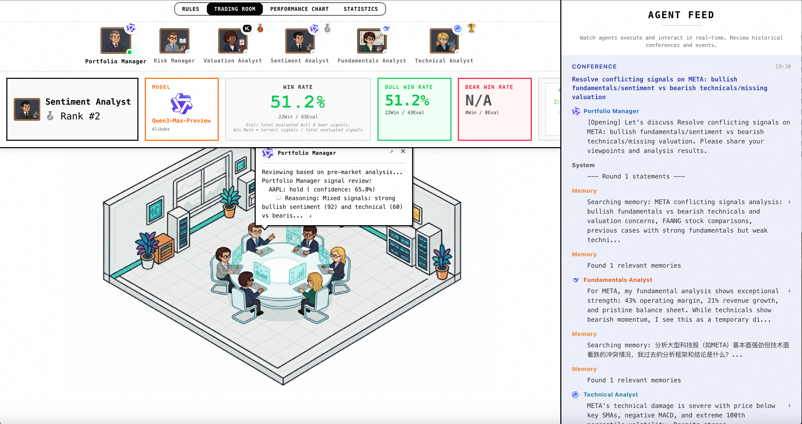
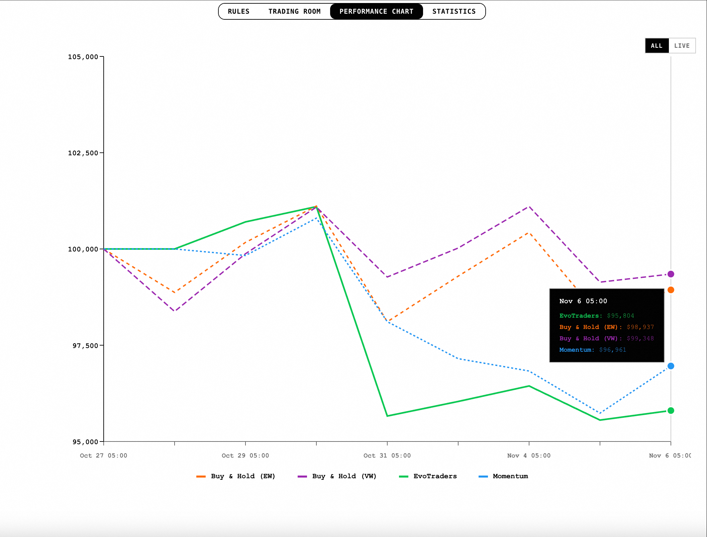

# EvoTraders：自我进化的多智能体交易系统

EvoTraders是一个开源的金融交易智能体框架，通过多智能体协作和记忆系统，构建能够在真实市场中持续学习与进化的交易系统。

我们希望当 AI Agents 组成团队进入实时市场，它们会逐渐形成自己的交易风格和决策偏好，而不是一次性的随机推理。




---

## 核心特性

**多智能体协作交易**  
6名成员，包含4种专业分析师角色（基本面、技术面、情绪、估值）+ 投资组合经理 + 风险管理，像真实交易团队一样协作决策。

**持续学习与进化**  
基于 ReMe 记忆框架，智能体在每次交易后反思总结，跨回合保留经验，形成独特的投资方法论。

**实时市场交易**  
支持实时行情接入，提供回测模式和实盘模式，让 AI Agents 在真实市场波动中学习和决策。

**可视化交易信息**  
实时观察 Agents 的分析过程、沟通记录和决策演化，完整追踪收益曲线和分析师表现。

<p>
  
  
</p>


---

## 快速开始

### 安装

```bash
# 克隆仓库
git clone https://github.com/agentscope-ai/agentscope-samples
cd agentscope-samples/EvoTraders

# 安装依赖
pip install -e .

# 配置环境变量
cp env.template .env
# 编辑 .env 文件，添加你的 API Keys
```

### 运行

**回测模式：**
```bash
evotraders backtest --start 2025-11-01 --end 2025-12-01
```

**实盘交易：**
```bash
evotraders live                    # 实时模式
evotraders live --mock             # Mock 模式（测试）
```

**启动可视化界面：**
```bash
evotraders frontend                # 默认连接 8765 端口
```

访问 `http://localhost:5173/` 查看交易大厅，选择日期并点击 Run/Replay 观察决策过程。

---

## 系统架构


### 智能体设计

**分析师团队：**
- **基本面分析师**：财务健康度、盈利能力、增长质量
- **技术分析师**：价格趋势、技术指标、动量分析
- **情绪分析师**：市场情绪、新闻舆情、内部人交易
- **估值分析师**：DCF、剩余收益、EV/EBITDA

**决策层：**
- **投资组合经理**：整合分析信号，执行沟通策略，最终决策
- **风险管理**：实时价格与波动率监控、头寸限制，多层风险预警

### 决策流程

```
实时行情 → 独立分析 → 智能沟通 (1v1/1vN/NvN) → 决策执行 → 收益反思 → 记忆更新
```

每个交易日经历四个阶段：
1. **分析阶段**：各智能体基于各自工具和历史经验独立分析
2. **沟通阶段**：通过私聊、通知、会议等方式交换观点
3. **决策阶段**：投资组合经理综合判断，给出最终交易
4. **复盘阶段**：基于市场反馈，智能体进行记忆管理


---

### 模块支持

- **智能体框架**：[AgentScope](https://github.com/modelscope/agentscope)
- **记忆系统**：ReMe
- **LLM 支持**：OpenAI、DeepSeek、Qwen、Moonshot、Zhipu AI 等


---

## 自定义配置

### 自定义分析师角色

1. 在 `backend/agents/prompts/analyst/persona.yaml` 注册角色信息
2. 在 `backend/config/constants.py` 添加角色定义
3. 在前端配置中引入新角色（可选）

### 自定义模型

在 `.env` 文件中配置不同智能体使用的模型：

```bash
AGENT_SENTIMENT_ANALYST_MODEL_NAME=qwen3-max-preview
AGENT_FUNDAMENTAL_ANALYST_MODEL_NAME=deepseek-chat
AGENT_TECHNICAL_ANALYST_MODEL_NAME=glm-4-plus
AGENT_VALUATION_ANALYST_MODEL_NAME=moonshot-v1-32k
```

### 项目结构

```
EvoTraders/
├── backend/
│   ├── agents/           # 智能体实现
│   ├── communication/    # 通信系统
│   ├── memory/          # 记忆系统 (ReMe)
│   ├── tools/           # 分析工具集
│   ├── servers/         # WebSocket 服务
│   └── cli.py           # CLI 入口
├── frontend/            # React 可视化界面
└── logs_and_memory/     # 日志和记忆数据
```

---

## 许可与免责

EvoTraders 是一个研究和教育项目，采用 Apache 2.0 许可协议开源。

**风险提示**：在实际资金交易前，请务必进行充分的测试和风险评估。历史表现不代表未来收益，投资有风险，决策需谨慎。
